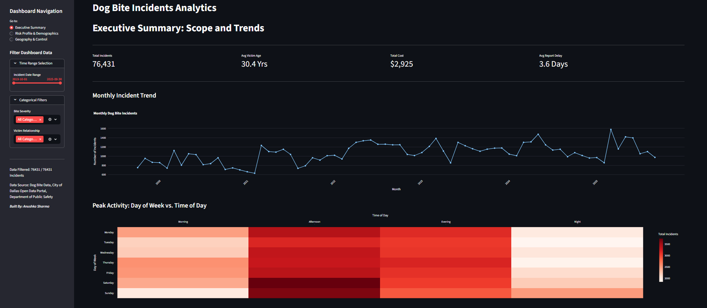
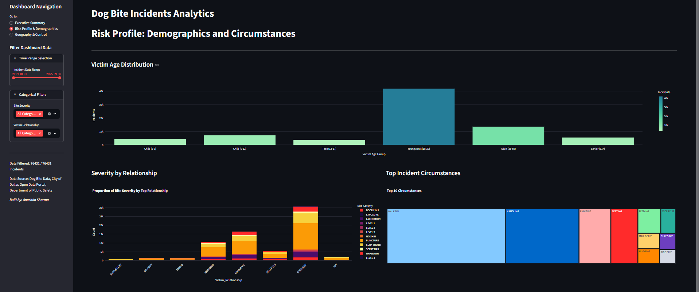
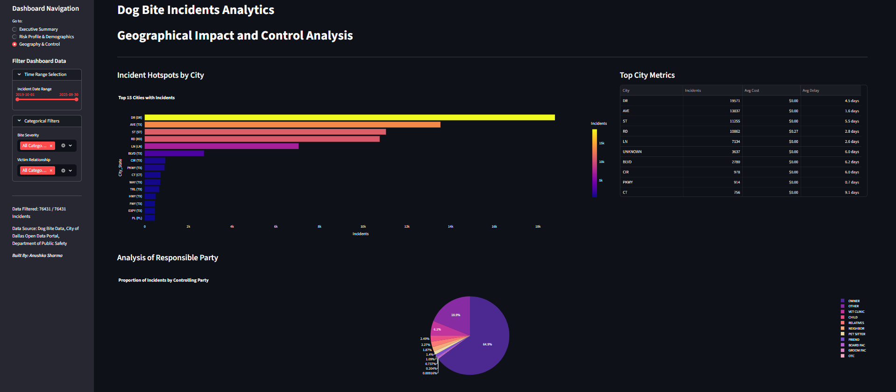
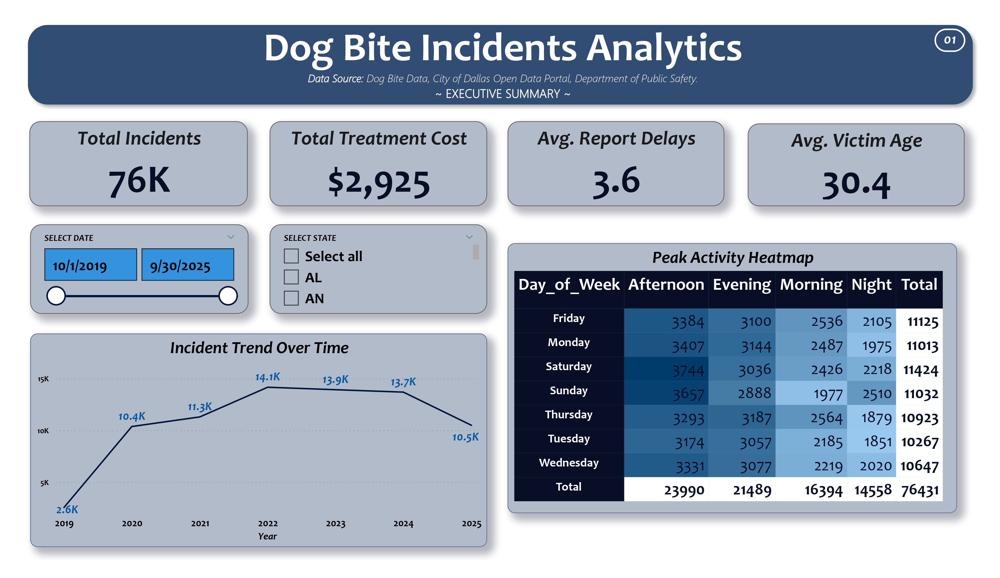
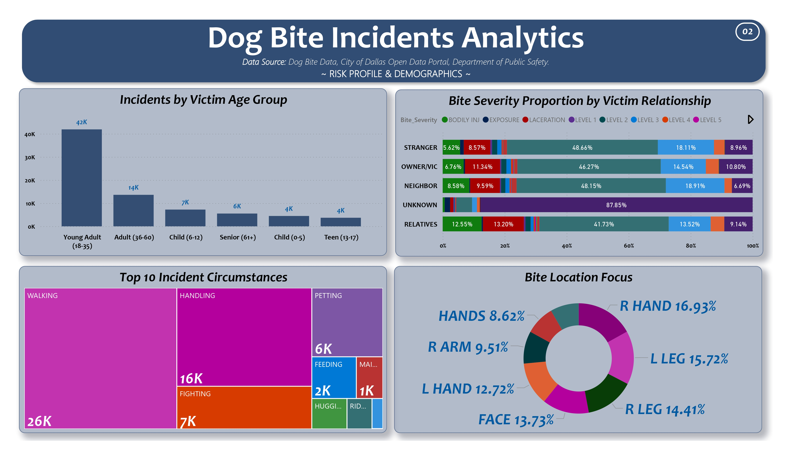
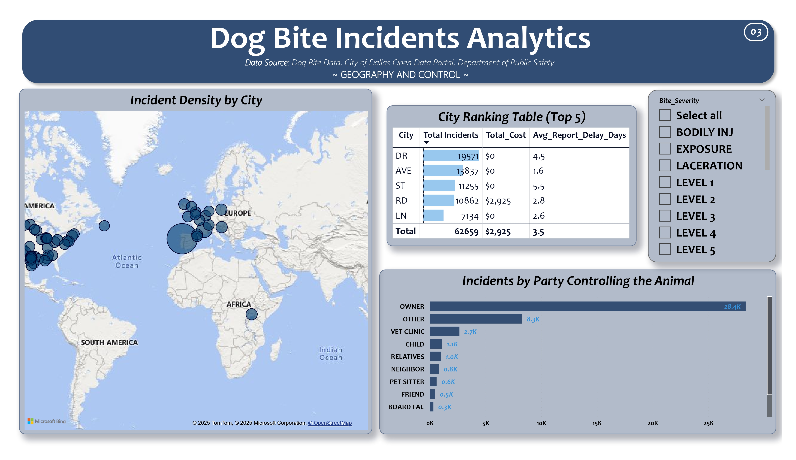

# 🐶 Dog Bite Incidents Analytics | Multi-Modal Dashboard Project 

## 📖 Introduction  
Daily animal control incidents present complex challenges related to public safety, location-based risk, and responsible pet ownership.
This project executes a full, end-to-end data analytics pipeline to analyze dog bite incident logs, uncover critical patterns, and deliver insights via dual reporting platforms.
It demonstrates expertise in **ETL, feature engineering, statistical analysis, interactive web dashboarding (Streamlit)**, and **professional business reporting (Power BI)**. 

Specifically, I drove the entire pipeline:
- **Data Transformation (Python/Pandas):** Achieved robust data cleaning and imputation using Python with the **pandas** and **numpy** libraries, handling mixed data types and standardizing over **76,000 records**.
- **Feature Engineering:** Engineered crucial temporal features (e.g., *Time of Day*, *Day of Week*), created demographic bins (e.g., *Victim Age Group*), and calculated the **Report Delay Days** metric to assess administrative efficiency.
- **Visualization & Analysis:** Employed **Plotly** for creating interactive, web-ready visualizations for trend analysis, and **Seaborn** for static exploratory charts.
- **Dual-Platform Deployment:** Presented final outputs as an **Interactive Streamlit Application** for real-time exploration and a **Professional Power BI Report** using **DAX** for sophisticated proportional metrics, optimized for high-quality **PDF export**.

## 🔗 Live Link  
👉 [Click here to explore the deployed dashboard](https://dogbiteanalytics.streamlit.app/) 

## 🖼️ Visual Previews
### Streamlit Interactive Dashboard Preview
This view highlights the dynamic, interactive nature of the web application, featuring the collapsed filters and Plotly visuals.




---

### Power BI Professional Report Preview
This represents the clean, static, multi-page layout optimized for print, demonstrating DAX measures and sophisticated data visualization.




## ✨ Features  
- 🧹 **Robust Data Cleaning (Python/Pandas):** Handled mixed data types, imputed missing age and location values, and standardized text categories (e.g., *"UNKNOWN"*).
- ⚙️ **Feature Engineering:** Created essential columns like *Day of Week*, *Time of Day*, *Victim Age Group*, and *Report Delay Days*.
- 🗺️ **Geographical & Temporal Analysis:** Identified peak incident hours (heatmap) and analyzed regional hotspots (city ranking).
- 📊 **Dual Visualization Platforms:**
  - **Interactive Streamlit Dashboard:** Multi-page web application featuring Plotly visuals, dynamic collapsible filters, and KPI tracking.  
  - **Professional Power BI Report:** Multi-page report optimized for print (PDF export), utilizing DAX measures and advanced proportional analysis (100% stacked charts).
- 📦 **Clean Data Export:** Finalized, clean data exported to Excel (`.xlsx`) with underscore-separated column names for immediate consumption by Power BI.

## 📊 Key Analytical Insights
This project uncovered several actionable findings crucial for public safety resource allocation:
- ⏰ **Peak Activity Hours:**  
  Incidents show a marked spike during late afternoons and evenings (*4 PM – 8 PM*) and peak significantly on weekends, suggesting higher incidence during leisure time.
- 🧒 **Vulnerable Groups:**  
  The *Child (6–12)* and *Teen (13–17)* age groups show a disproportionately high count of incidents relative to other demographics.
- ⚠️ **Severity Correlation:**  
  Bites involving *STRANGER* relationships show a different proportional severity profile compared to those involving *OWNER/VIC*, indicating that the context of the incident directly impacts outcome severity.
- 🕒 **Reporting Efficiency:**  
  The *Avg Report Delay Days* metric highlights administrative lag times, which is crucial for assessing public health response efficiency.

## 🛠️ Tech Stack  
| **Category**              | **Tools / Libraries**                                  | **Purpose**                                            |
|----------------------------|--------------------------------------------------------|--------------------------------------------------------|
| **Data Handling (ETL)**    | Python, `pandas`, `numpy`, `datetime`                 | Cleaning, Transformation, Feature Engineering          |
| **Visualization**          | `matplotlib`, `seaborn`, `plotly`                     | Static and Interactive Chart Generation                |
| **Interactive Dashboard**  | `Streamlit`, `plotly.express`                         | Multi-page Web Application Development                 |
| **Advanced Reporting**     | Power BI, DAX, Power Query (M)                        | Business Intelligence Report & Data Modeling           |
| **Notebook Environment**   | Jupyter Notebooks                                     | Data Exploration and Documentation                     |


## 🔄 Project Workflow
- **📂 Data Load & Clean:**  
  Raw data (`Dog_Bite_Dataset.csv`) is loaded.  
  Python performs conversion, imputation, and feature engineering *(documented in `preprocessing.ipynb`).*
- **📊 Analysis & Visualization:**  
  Key trends (Time, Age, Circumstance) are discovered and visualized using **Plotly** in the Streamlit app *(documented in `eda.ipynb`).*
- **📤 Data Export:**  
  The cleaned and enriched dataset is exported to `Cleaned_Dog_Bite_Dataset.csv`.
- **🖥️ Dashboard Build:**  
  The **Streamlit app** (`streamlit_app.py`) runs the entire cleaning logic once (using `@st.cache_data`) and presents the interactive, filtered views.
- **📈 Power BI Modeling:**  
  The CSV file is imported into **Power BI** for modeling, **DAX** calculation, and report creation *(report saved as `powerbi/Report.pdf`).*

## 📂 Repository Structure  
```
├── 📁 powerbi/
│   ├── Power BI Report.pbix
│   └── Report.pdf
│
├── 📁 imgs/
│   ├── incident_trend_by_year.png
│   ├── incidents_by_day_of_week.png
│   ├── severity_by_relationship_stacked.png
│   ├── top_10_bite_circumstances.png
│   ├── report_page1.jpg
│   ├── report_page2.jpg
│   ├── report_page3.jpg
│   ├── dashboard_page1.png
│   ├── dashboard_page2.png
│   └── dashboard_page3.png
│
├── Dog_Bite_Dataset.csv
├── Preprocessed_Dog_Bite_Dataset.png
├── Cleaned_Dog_Bite_Dataset.png
│
├── preprocessing.ipynb
├── eda.ipynb
├── streamlit_app.py
│
├── requirements.txt
└── README.md
```

## 🎯 Use Cases  
- 🏥 **Public Health & Safety:**  
  Pinpointing high-risk times and areas requiring increased animal control patrols or public education campaigns.
- 🏘️ **Community Risk Assessment:**  
  Allowing neighborhood leaders to identify and mitigate high-frequency risk factors (e.g., proportional risk assessment by victim relationship).
- 💰 **Resource Allocation:**  
  Providing metrics on total treatment cost and report delay for budgetary and administrative planning.
- 💼 **Data Science Showcase:**  
  A powerful demonstration of end-to-end data processing, feature engineering, custom data modeling, and multi-platform dashboarding skills.

## ⚡ Setup Instructions  
1. **Clone the repository**  
   ```bash
   git clone https://github.com/Anushka-Sharma-008/DogBiteAnalysis.git
   cd DogBiteAnalysis
   ```
2. **Launch Streamlit Dashboard**
   ```
   streamlit run streamlit_app.py
   ```

## 🙋‍♀️ Author
**Anushka Sharma**  
🌐 [LinkedIn](https://www.linkedin.com/in/anushkasharma008/) • 🐱 [GitHub](https://github.com/Anushka-Sharma-008) 
🎓 Learning Data Science, Analytics & Machine Learning

## ⭐ Show Your Support
If you found this project helpful or inspiring:
- ⭐ Star this repository  
- 🛠️ Fork it to build upon or adapt it for your own use  
- 💬 Share feedback or suggestions via Issues/Discussions
